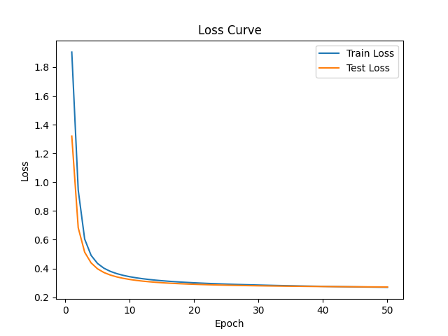
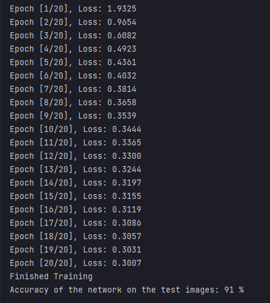

# *learning notes* by 叶庭宏
## *Day1* （2024.3.12）


今天的进度为完成了第一题的主要部分，还差代入指标计算函数和探索参数对模型表现的影响。空余时间为第5、6节课，11、12节课和半夜。以下是对学习过程的回顾和总结。

### 1. 评测指标
上周模式识别刚讲了二分类情况下的评测指标，复习了一下。计算评测指标代码没啥东西，套公式就完事了。
主要在于理解每个指标的意义：
- Accurancy：整体预测正确情况占比。
- Precision：不要求整体准确率高，只要positive类中精度高。“冤假错案成本高，漏网之鱼成本低”。
- Recall：不管是不是真的positive，都要抓出来。宁可错杀一千，不可放过一个。
- F1：综合考虑Accurancy和Recall，达到两者的最大平衡。

### 2. 全连接层
网上找资料了解了一下用nn.Linear构建全连接层和前向传播的原理和方法。
- 全连接层：
```
class Fully_Connected(nn.Module):
    def __init__(self, input, hidden1, hidden2, output):
        super(Fully_Connected, self).__init__()
        self.fc1 = nn.Linear(input, hidden1)
        self.fc2 = nn.Linear(hidden1, hidden2)
        self.fc3 = nn.Linear(hidden2, output)
```
传入参数为输入层、中间各层、输出层的神经元个数。main中输出为10是因为label共有10种。

- 前向传播函数
```
def forward(self, x):
    x = self.fc1(x)
    x = self.fc2(x)
    x = self.fc3(x)
    return x
```

### 3. 分类任务
先在网上学习了MNIST数据集读取的方法，最终提取出测试集和训练集的img和label共四个数组。调用全连接网络输入各级神经元个数（28 * 28, 128, 256, 10）并存入模型。分批训练，步骤如下：**前向传播 -> 计算loss值 -> 反向传播 -> 用优化器更新参数**，以此循环若干epoch，并将每次迭代的loss值可视化。

后用测试集计算准确率Accurancy。选择outputs中的最大值（概率最高即置信度最高，视为预测结果），第二个参数predicted为最大值对应索引，即label。最终计算预测正确的样本数，除以测试集总样本数即为Accurancy。今日测试结果如下：


